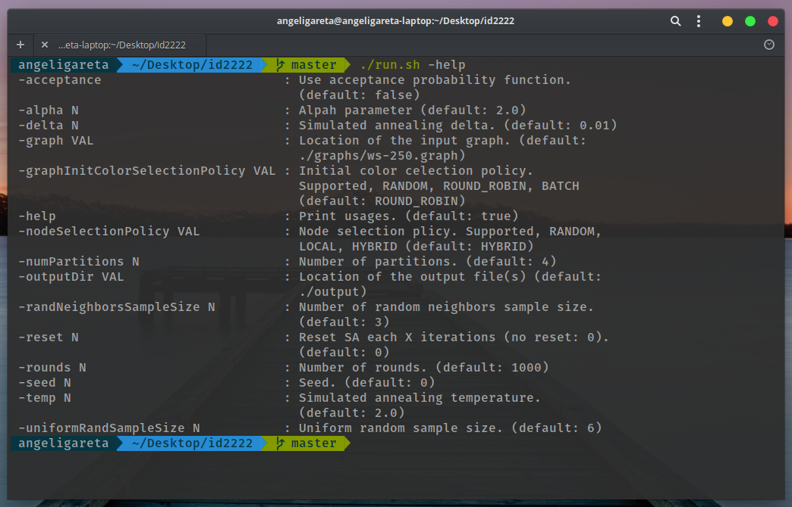

<h1 align="center">K-way Graph Partitioning Using JaBeJa</h1>
<h4 align="center">Fifth lab of the Data Mining course of the EIT Digital data science master at <a href="https://www.kth.se/en">KTH</a></h4>

    
  
  

## Problem statement

This project aims to study distributed graph partitioning techniques by implementing the [JaBeJa algorithm](http://www.diva-portal.org/smash/get/diva2:668109/FULLTEXT01.pdf). The problem of balanced graph partitioning is a well-known NP-complete problem with applications in numerous fields such as in Cloud Infrastructure. This algorithm uses local search and simulated annealing techniques and it is massively parallel, which avoids strict synchronization.

The algorithm would be implemented using a scaffolding source code written in Java for simulating it in a one-host-multiple-node model, available in Github. Once the implementation is complete, a hyper tuning will be performed by modifying the parameters that affect the graph partitioning metrics, specially edge-cut. Finally, some modifications of the algorithm would be tested in order to achieve better performance.

## Tools

In order to implement the proposed algorithm, the Java programming language was used. Regarding the visualization and analysis of the results, both Gnuplot and Excel were used.

## Implementation

The algorithm begins with the execution of the ‘startJabeja’ method, which runs the ‘sampleAndSwap’ procedure in a loop for the number of specified rounds. As simulated annealing is being used, also after each round, the temperature is updated correspondingly.

During the sample and swap stage, a local search is performed to find the neighbors for the current node, according to the node selection policy. After this, if the best candidate is found, the colors of the nodes among the graph will be swapped.

The search for the best candidate to swap can depend either on the acceptance probability of simulated annealing or by taking the node which maximizes the sum of the node degrees of the graph.

## How to run code

The code can be run using the helper scripts ‘compile’, ‘run -graph <graph>’, and ‘plot <output/result.txt>’. For the second script, some parameters can be passed in order to configure the execution (see the following figure). Note that acceptance and reset parameters have been added from the original code.

## Results

The full results can be found in the [final report](docs/report.pdf).

## Modifications
With the aim of improving the original algorithm, some modifications were tested:
- Avoiding simulated annealing. This modification resulted in fast convergence and poor results.
- Instead of maximizing the sum of node degrees, take also into account the degree increment compared to the total number of neighbors of the node.
- Modifying the acceptance probability function to ‘newEdgeCut / oldEdgeCut’.
- Modifying the simulated annealing to accept the solutions every time they are better and use the acceptance probability function when they are worse. 
- Modifying the acceptance probability function to ‘Math.pow(2, 1/(round+1))’ and the minimum temperature to 1.0001, so that it does not follow an exponential distribution as the normal simulated annealing proposes. Also, other functions were tested for the same aim but the results were very similar.
 
The best results modifying the original solutions were obtained with the 4th modification, the results were the following:
Dataset | SA-Reset | SA-No-Reset
| ------------- |:-------------:| -----:|
3elt | **823** | 1306
add20 | **2187** | 2207
Twitter | **40941** | 40944

## Authors

- Original authors of the [JaBeJa repository](https://github.com/smkniazi/id2222).
- Serghei Socolovschi [serghei@kth.se](mailto:serghei@kth.se)
- Angel Igareta [alih2@kth.se](mailto:alih2@kth.se)
